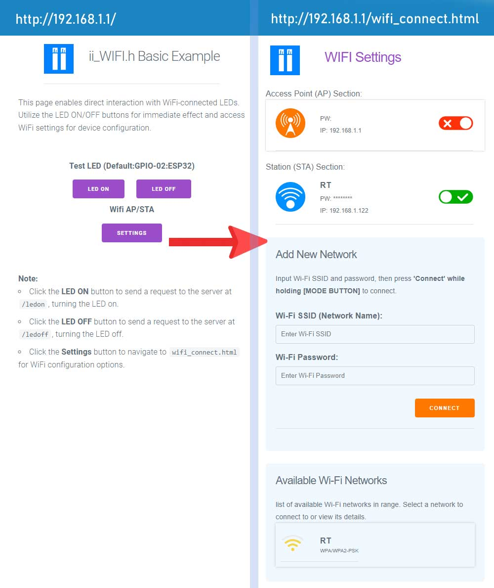

# ii_WIFI Library

## Features
- Simplify connecting to Wi-Fi networks
- Manage network settings and configurations
- Efficient handling of Wi-Fi communication
- Additional features specific to the library...

The ii_WIFI library is tailored for effortless management of Wi-Fi connectivity on ESP32 devices. It simplifies the process of establishing and maintaining Wi-Fi connections. Upon device startup, it automatically initiates an access point, allowing users to connect and update Wi-Fi credentials seamlessly. In conjunction with the ii_ROM.h library, Wi-Fi credentials are securely stored in ROM, enabling the device to automatically reconnect to the specified Wi-Fi network every time it starts.

Additionally, the library facilitates easy management of server APIs and a File Server, making it a versatile tool for networked ESP32 projects. Here is the simplest way to get started with the ii_WIFI library for establishing a Wi-Fi connection.
 
   ```cpp
      #include <ii_WIFI.h>

      ii_WIFI wifi;
      
      void setup() {
         // wifi.setSTA("WIFI_SSID","WIFI_PW");
         // wifi.setAP("ii-WIFI-AccessPoint","12345678");
         wifi.connect(true);
      }

      void loop() {
      // Main code to be executed repeatedly goes here.
      }
   ```

## Wi-Fi Connection Flow
The flow chart below illustrates the decision-making process of the ii_WIFI library at startup:


1. On startup, the library checks if the mode switch is pressed.
   - If true, it proceeds to Access Point mode.
   - If false, it attempts to connect to Wi-Fi Station mode.
2. In Access Point mode, it checks for predefined SSID and password.
   - If not found, it generates a default SSID and password.
3. In Wi-Fi Station mode, it looks for stored credentials in ROM.
   - If credentials are available, it attempts to connect.
   - If the connection fails or credentials are not set, it shows a failed status.

Here's how you can structure the `README.md` section for the `ii_WIFI` library, modeled after the `ii_LedArray` library's getting started guide:

---

## Getting Started:

The `ii_WIFI` library streamlines the management of Wi-Fi connectivity on ESP32 devices. Include the `ii_WIFI.h` header in your Arduino sketch, configure your Wi-Fi credentials, and the library will handle the rest, from automatic Access Point creation to Wi-Fi network connection.

### Installation for Visual Studio Code with PlatformIO

#### Method 1: Manual Library Installation

1. **Clone the Repository**:
   - In Visual Studio Code, access the terminal (`Terminal` > `New Terminal`).
   - Clone the repository with:
     ```
     git clone https://github.com/ii-lk/ii_WIFI.git
     ```
   - This command clones the `ii_WIFI` library to a local directory.

2. **Copy the Library into Your Project**:
   - With a PlatformIO project open, manually copy the `ii_WIFI` directory into the `lib` folder of your project.

#### Method 2: Automatic Dependency Management

1. **Modify `platformio.ini`**:
   - In your PlatformIO project, find the `platformio.ini` file.
   - Open it for editing.

2. **Declare Library Dependency**:
   - Add this line under the `[env]` section of your `platformio.ini`:
     ```
     lib_deps = ESP Async WebServer 
            ArduinoJson
            https://github.com/ii-lk/ii_ROM.git
            https://github.com/ii-lk/ii_WIFI.git 
     ```
   - PlatformIO will automatically handle the download and management of the `ii_WIFI` library.

 
 
# WiFi 01: Basic Connect Example

## Overview

This example demonstrates the basic functionality of the `ii_WIFI.h` library, showing how to establish Wi-Fi connectivity on an ESP32 device. It's compatible with the Arduino IDE.

## Setup Instructions

1. **Install Libraries**:
   - Download `ii_WIFI` and `ii_ROM` libraries.
   - Place them in the `Documents\Arduino\libraries` directory.

2. **Load the Example**:
   - Navigate to `Documents\Arduino\libraries\ii_WIFI\examples\wifi_01_basic_connect`.
   - Open the example with the Arduino IDE.

3. **Board and Port Selection**:
   - Select your ESP32 board from the Tools > Board menu.
   - Choose the correct port connected to your ESP32 device.

4. **Upload the Sketch**:
   - Compile and upload the code to your ESP32 board.
   - Open the Serial Monitor to view the output.

## Serial Monitor Output

The Serial Monitor will display the following upon successful upload:

```
Connecting AP
Mode: Access Point
SSID: ii-AIAX  PW: 12345678
192.168.1.1
---
# List of Server Paths
192.168.1.1/networks_list
192.168.1.1/wifi_connect
192.168.1.1/wifi_disconnect
192.168.1.1/wifi_status
192.168.1.1/ledon
192.168.1.1/ledoff
```

## Connect and Control

- Connect to the ESP32 Access Point using the provided SSID and password.
- Navigate to `192.168.1.1/ledon` or `192.168.1.1/ledoff` in your browser to turn the LEDs on or off, respectively.

## Customization

- Set a custom Access Point SSID and password by uncommenting and editing:
  ```cpp
  // wifi.setAP("Your_Custom_SSID", "Your_Custom_Password");
  ```
- Connect to your own network by uncommenting and editing:
  ```cpp
  // wifi.setSTA("Your_WiFi_SSID", "Your_WiFi_Password");
  ```
  If the ESP32 connects to your network, it will display a different IP address. Use this IP to control the LEDs from any device connected to your network, e.g., `192.168.1.122/ledon`.

 
## WiFi 02: StoreCredentials and UI Example
 
### Initial Setup
First, upload the HTML files from the `/data` folder to the ESP32 file system:
1. Connect the ESP32 to your computer via USB and select the correct COM port.
2. Open Visual Studio Code and navigate to the PlatformIO sidebar.
3. Click on the "PlatformIO" icon, then select "Upload File System Image".

A successful upload will show a message in the terminal similar to:
```
...
Writing at 0x002bf254... (83 %)
Writing at 0x002c9505... (100 %)
Wrote 1441792 bytes (93036 compressed) at 0x00290000 in 5.6 seconds (effective 2067.1 kbit/s)...
Hash of data verified.
```

### Uploading Example Code
Once the HTML files are uploaded, proceed to upload the example code to the ESP32:
1. Use PlatformIO to upload the example sketch to your device.
2. Open the "PlatformIO: Serial Monitor" to view serial output.

### Wi-Fi Configuration
To set up Wi-Fi settings, use the physical interface on the ESP32:
1. Press the "Mode" switch on the ESP32 and then press the `[EN]` button to restart the device.
2. The library will activate the Access Point mode with an auto-generated SSID and the default password `12345678`.
    - To customize the Access Point SSID and password, insert the following line before `wifi.connect(true);` in the `main.cpp` file:
      ```cpp
      // wifi.setAP("Your_Custom_SSID", "Your_Custom_Password");
      ```

In the Serial Monitor, you'll see details like:
```
AP MODE SWITCH ACTIVATED
Reading wifi list...
[{"SSID": "RT", "RSSI": -62, "Encryption": "WPA/WPA2-PSK"}] // Nearby Wi-Fi networks
SPIFFS Started!
Server Started!
Connecting AP
Mode: Access Point
SSID: ii-LWVF    PW: 12345678
IP: 192.168.1.1
```

### Connecting to the Access Point
With a Wi-Fi-enabled device:
1. Search for Wi-Fi networks and connect to the auto-generated `ii_xxxx` SSID as shown in the Serial Monitor.
2. Use the password `12345678` to connect.
3. Open a web browser and navigate to `http://192.168.1.1`.
    - If the page doesn't load, temporarily disable mobile data.

Now you should see the HTML page served from the ESP32 file system.

---

Make sure to replace placeholders like `"Your_Custom_SSID"` and `"Your_Custom_Password"` with the actual SSID and password you wish to use for your Access Point. This guide assumes that the user has a basic understanding of how to operate the PlatformIO environment and ESP32 hardware.

```cpp
#include <Arduino.h>
#include <ii_WIFI.h>
#include <ii_ROM.h>

ii_ROM rom;
#define ROM_WIFI_SSID 0     // Define constant for WiFi SSID in ROM
#define ROM_WIFI_PASSWORD 1 // Define constant for WiFi password in ROM

ii_WIFI wifi;

void setup()
{
  Serial.begin(115200); // Start serial communication at 115200 baud rate

  rom.begin(10, 4096); // Initialize ROM with 10 blocks, each of 4096 bytes

  // Configure WiFi settings
  wifi.setModePin(15, HIGH);                             // Set the mode pin (15) and its state (HIGH)
  wifi.setMemory(rom, ROM_WIFI_SSID, ROM_WIFI_PASSWORD); // Set ROM memory for storing WiFi credentials

  wifi.connect(true); // Connect to WiFi. If true, wait for connection

  // Configure server paths for LED control
  // Path for turning LED on
  wifi.addPath("/ledon", HTTP_GET, [](AsyncWebServerRequest *request)
               {
                 digitalWrite(PIN_DEBUG, HIGH);              // Turn LED on
                 request->send(200, "text/plain", "LED ON"); // Send response
               });

  // Path for turning LED off
  wifi.addPath("/ledoff", HTTP_GET, [](AsyncWebServerRequest *request)
               {
                 digitalWrite(PIN_DEBUG, LOW);                // Turn LED off
                 request->send(200, "text/plain", "LED OFF"); // Send response
               });
}

void loop()
{
  // Main code to run repeatedly goes here
}

```
